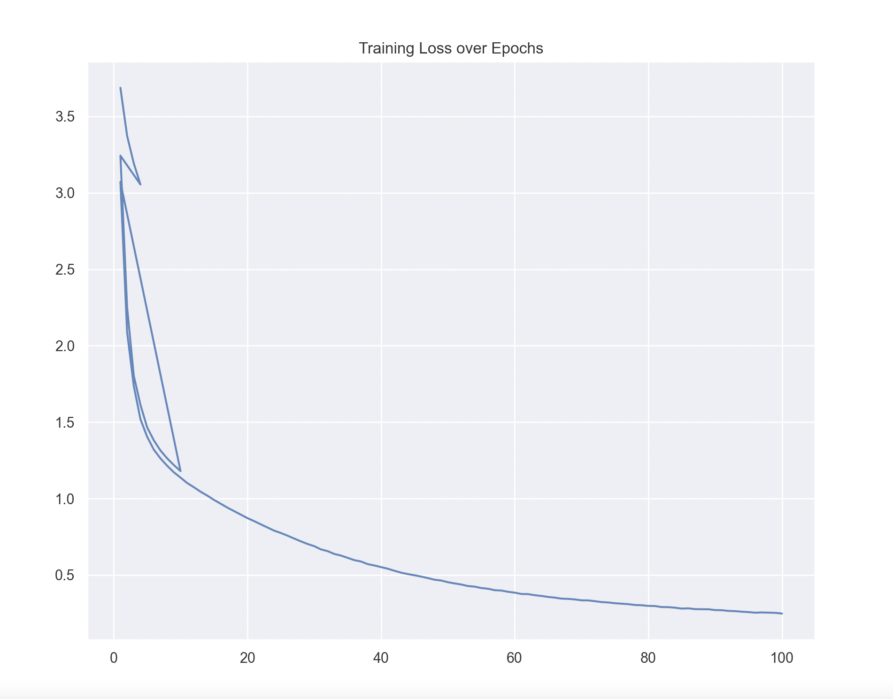
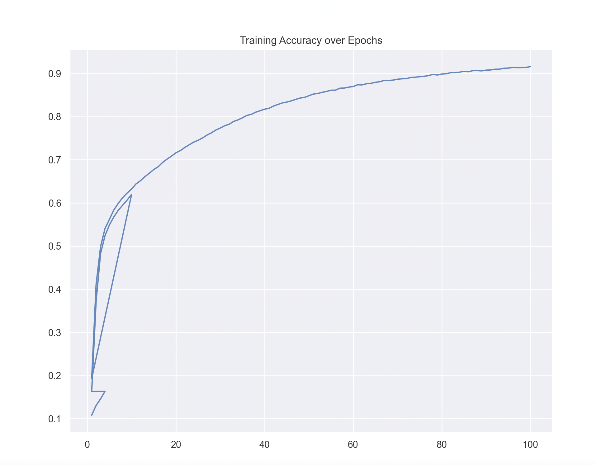

# char-rnn-keras

Multi-layer recurrent neural networks for training and sampling from texts, inspired by [karpathy/char-rnn](https://github.com/karpathy/char-rnn).

### Requirements

This code is written in Python 3, and it requires the [Keras](https://keras.io) deep learning library.

### Usage

All input data should be placed in the `data/` directory. The example `input.txt` is taken from the [Nottingham Dataset -jigs](http://abc.sourceforge.net/NMD/nmd/jigs.txt).
and `hpps.txt` is taken from   [Nottingham Dataset -HornPipes](http://abc.sourceforge.net/NMD/nmd/hpps.txt).

To train the model with default settings:
```bash
$ python train.py
```


Training loss/accuracy is stored in `logs/training_log.csv`.

Models were saved in `models` directory.

### Plot the Loss and Accuracy plot
#### Loss plot


#### Accuracy plot


###To sample the model:
```bash
$ python3 sample.py --epoch 100 --seed cr --len 2048


```

### Sample Output
```yaml

cri||kb Mois fb wbpll lal 11/
%%MIDI bassvol 111
P:A
{:c/2d/2{"Am"e2A A^GA{"C"GEE E^GA{"Em"B2A E3{"C"BGE CCE{
"G"DGB BGB{"Am"cBc DFA{"D7"dfa gfd{"G"BcB A2:{
P:B
B{"D7"def g2a{"G"b^ag g2g{"Em"def "D7"g2d{
"G"g2g gaG{"G"gab "D7"aga{"G"bge "D7"dBG{"G"gdB "D"AGF{"G"G3 -G2{{


X: 251
T:Red Chery
% Nottingham Music Database
Y:AABBCC
S:Whitby 1989, via EF
M:6/8
K:D
P:A
{:d/2e/2{"D"f2e d2c{"D"d2B A2d{"A"e2d "F#m"c2c{"Bm"BAB "F#m"AGF{"Em"EGF "A7"EFG{
"D"A3 "A7"ecA{"D"dfd "A7"ede{"D"f2d AFA{"G"BA2 "A7"B2c{"D"d3 d2d{"Em"e2d "A7"B2c{\"D"d2d "A7"d2c{"D"d2A F2A{
"G"Bcd f2e{"D"Adf "A"edc{"G"Bcd "A7"ecA{"G"BG2 -"A7"A2G{\
"D"FGA "Em"BAG{"A7"FED "A7"EDE{"D"F2F DEF{"G"G3 -G2:{


X: 200
T:Mccle Mackicg
% Nottingham Music Database
S:NPTB, via EF
Y:ABC
M:6/8
K:G
P:A
{:d/2c/2{"G"B2G dGB{"D7"A2F DED{"G"B2G "D7"AGF{"G"G2B "Em"d2d{
"A7"c2B A2G{"D7"ABA D3{"G"G2G "D7"AGF{"G"G3 -G2:{
P:B
{:d/2c/2{"G"def gfe{"G"d3 B3{"Am"c2c a2g{"D7"fef f2e{"D7"d3 d2d{\
"C"e2f g3/2g/2=g/2{
"F"f3 "A7"e2c{"Dm"ded "G7"e2d{"C"e2e "Am"edc{"D7"dBG "G"G2:{


X: 22
```


### How to convert above text output to music

copy paste above output in [abcjs.net](https://www.abcjs.net/abcjs-editor.html)


